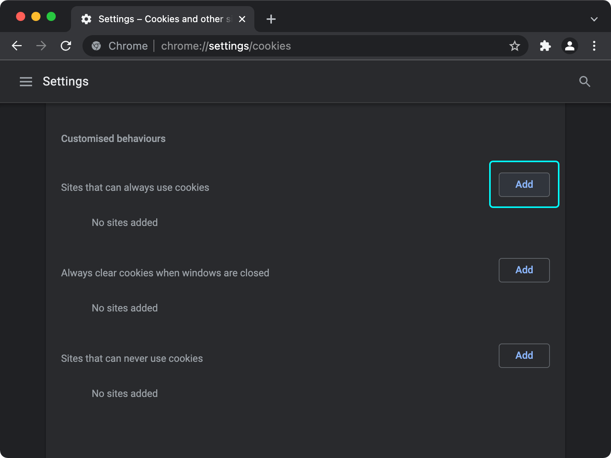
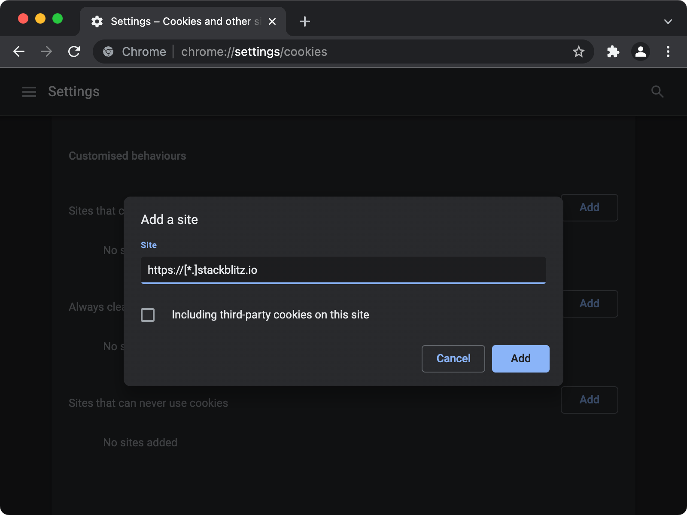
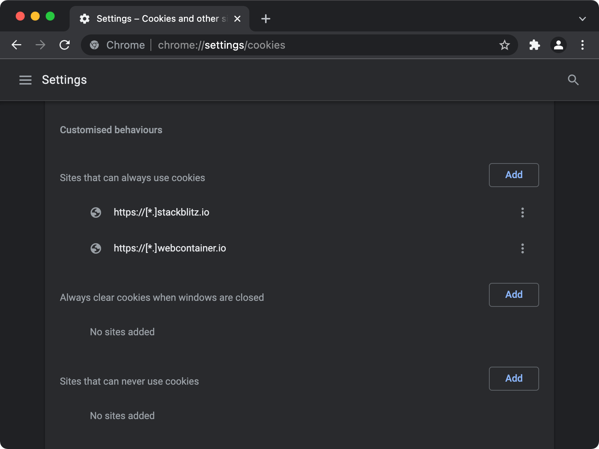
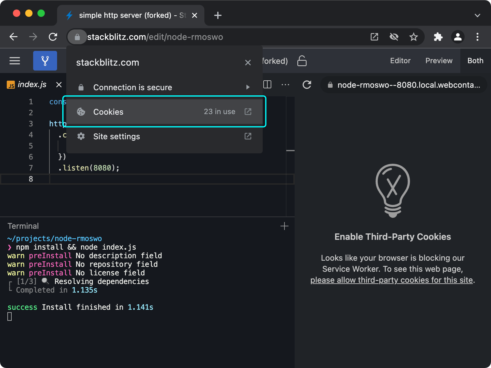
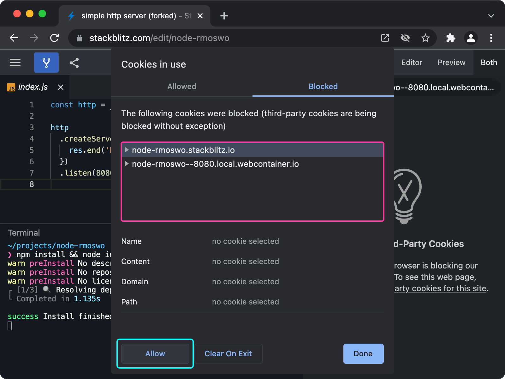
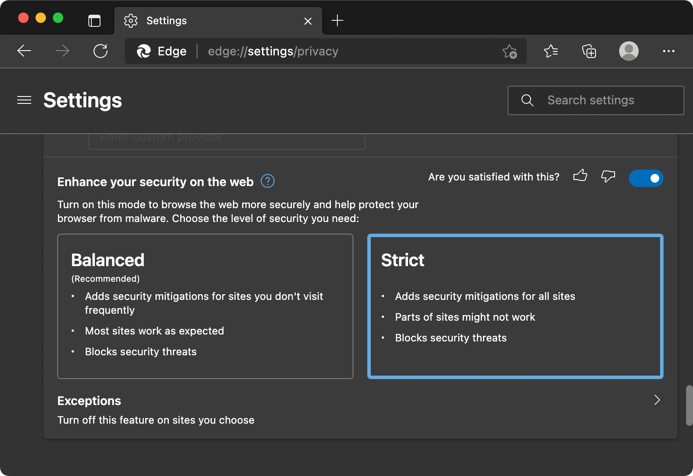
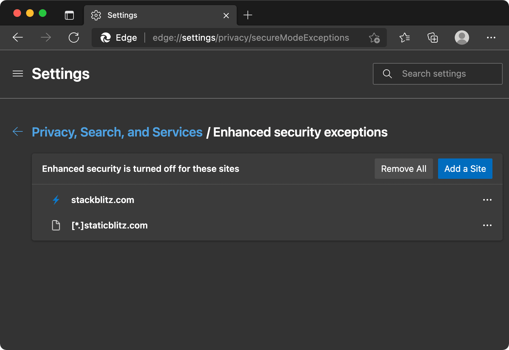

# {{ $frontmatter.title }}

While [all supported browsers](./browser-support) can run WebContainers, some browser options can stop WebContainers from running correctly.

You can work around those issues by adding exceptions for StackBlitz domains in your browser’s settings. Here’s how.

## Why do I need to add exceptions for StackBlitz?

WebContainers use a combination of browser technologies, such as [Service Worker][MDN_SERVICE_WORKER] and [WebAssembly][MDN_WEB_ASSEMBLY], across several domains. Each running project has its own domain and needs to install a Service Worker for that domain to work properly.

In some browsers, this feature is blocked by “third-party cookie” or “third-party storage” restrictions. These are legitimate restrictions when the third-party domain is an ad server or a tracking server, but in the case of WebContainers the third-party domain is where your project code runs.

## Chrome: enabling Service Workers {#chrome-service-workers}

If you use the “Block Third Party Cookies” option in Chrome, you will need to add exceptions for StackBlitz projects.

To allow all StackBlitz projects to use Service Workers, go to your browser’s cookie preferences, and add exceptions for the following URL patterns:

```
https://[*.]stackblitz.io
https://[*.]webcontainer.io
```

For instance, in Chrome, go to [chrome://settings/cookies](chrome://settings/cookies) and add those exceptions in the “Sites that can always use cookies” section.







:::details Advanced: enabling Service Workers for a single project

If you don’t want to allow Service Workers and third-party cookies for all StackBlitz projects, you can add exceptions for individual projects instead.

Note that this may not be very practical, because the exact domain for a project can change between sessions.

In Chrome, click the lock icon in the navigation bar:





If that is the case, choose to “Allow” cookies for those third-party domains. After that, the browser will prompt you to reload the page and you will be able to run the current project.

Note that the list of blocked domains might look different for you. In particular, a `xyz.local.webcontainer.io` domain might not be present. WebContainers-based projects use different domains dynamically, depending on what the runtime is doing (for instance, whether it is serving HTTP content or not), so you might need to check the list of blocked domains later if you see something off again.

:::

## Brave: enabling Service Workers {#brave-service-workers}

By default, Brave’s “Shields” feature blocks [Service Workers][MDN_SERVICE_WORKER] and cookies from third-party domains.

To allow WebContainers to run in Brave, you will need to add an exception for StackBlitz:

1. Visit a WebContainers-based project, for instance https://stackblitz.com/edit/nextjs. The project’s boot sequence might stay stuck on the “Running start command” step:


2. Click on the “Shields” icon at the right of the address bar, then click on “Advanced View”.


3. In the advanced view, change the “Cross-site cookies blocked” option to “All cookies allowed”.


Brave will reload the page, and you should get a working project:


## Edge: enabling WebAssembly {#edge-webassembly}

Microsoft Edge disables usage of [WebAssembly][MDN_WEB_ASSEMBLY] when you set its “Enhance your security on the web” option to “Strict”.

To allow StackBlitz projects to run, either set this option to “Balanced” or add exceptions for a couple domains used by StackBlitz projects.

1. Go to [edge://settings/privacy](edge://settings/privacy) → “Enhance your security on the web”.



2. Then click “Exceptions”, and add exceptions for the following domains:

```
stackblitz.com
[*.]staticblitz.com
```




[MDN_SERVICE_WORKER]: https://developer.mozilla.org/en-US/docs/Web/API/Service_Worker_API
[MDN_WEB_ASSEMBLY]: https://developer.mozilla.org/en-US/docs/WebAssembly
