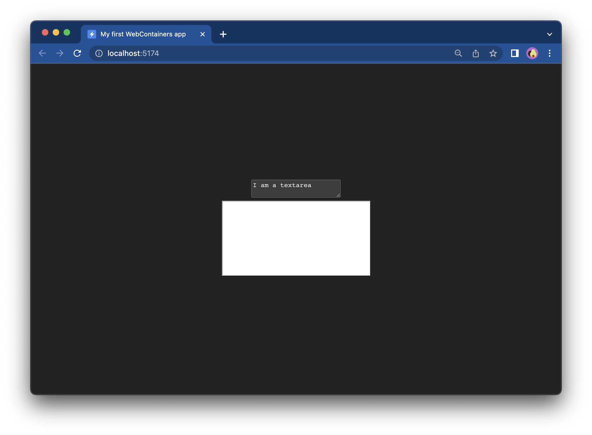

# {{ $frontmatter.title }}

In this tutorial, you'll build a plain [Vite](https://vitejs.dev/)-based JavaScript app featuring a barebones WebContainers app that loads the whole file system into the container and then runs the [Express](https://expressjs.com/) app. You don't need prior experience with Vite, Express, or WebContainers.

Your app will feature an editable `textarea` on the left and a Preview window on the right. This is where you will be able to see the output of the Express server.


## Before you begin

You can follow along this tutorial using our [Vite starter](https://stackblitz.com/edit/vitejs-vite-jkerkn?file=index.html&terminal=dev) which you can later share with friends, colleagues, or on social media:

[](https://vite.new)

Alternatively, you can develop the app locally, which requires additional setup:

::: details Setup instructions for local development

## Prerequisites

Before you proceed, make sure to have the following installed:

- Node v14 or higher
- `npm` (or `pnpm` or `yarn`)

## Initialize a new Vite app with the vanilla JavaScript template:

If you're using the StackBlitz editor, you can skip this step.

In the terminal, run the following command to initialize a new Vite app:

```bash
npm create vite webcontainers-express-app --template vanilla
```

You'll see a new directory called `webcontainers-express-app` with a Vite app. Enter that directory, install the dependencies, and run the dev server:

```bash
cd webcontainers-express-app
npm install
npm run dev
```

When the dev server starts, you will see a `localhost` URL in the terminal - click on the link to see the preview page. You should see the following screen:


:::

If you're already curious about the outcome of the tutorial, check out [this demo](https://webcontainer.new) 👀


## 1. Prepare the files in the Vite app

In your Vite app, there are only two files that you will need: `index.html` and `main.js`. Replace the contents of `main.js` with the following code:

::: code-group

```js [main.js]
import './style.css';

document.querySelector('#app').innerHTML = ``;
```

:::

You can now remove `counter.js` as you won't need it anymore. Now your app looks very minimalistic:


You might have noticed that we have also changed the name and the logo on the browser tab. You can do so in `index.html`.

## 2. Create and style a `textarea` and an `iframe`

Now let's set up HTML and styles for your app. You'll need to build two areas: a `textarea` in which the code will be featured, and an `iframe` to show the rendered output.

First, let's create a file called `loading.html` the entire contents of which are as follows:

::: code-group

```js [loading.html]
Installing dependencies...
```

:::

We will add this file to an iframe that will be visible in the preview only when the WebContainer is getting ready. After that, it will be replaced with the WebContainer output.

Now, let's build a scaffolding by adding HTML to the `#app` element in `main.js`:

::: code-group

```js [main.js]
document.querySelector('#app').innerHTML = `
  <div class="container">
    <div class="editor">
      <textarea>I am a textarea</textarea>
    </div>
    <div class="preview">
      <iframe src="loading.html"></iframe>
    </div>
  </div>
`
```

:::

Our page now features two boxes:



Let's make it look nicer now. Replace the contents of `style.css` with the following code:

::: code-group

```css [style.css]
* {
  box-sizing: border-box;
}

body {
  margin: 0;
  height: 100vh;
}

.container {
  display: grid;
  grid-template-columns: 1fr 1fr;
  gap: 1rem;
  height: 100%;
  width: 100%;
}

textarea {
  width: 100%;
  height: 100%;
  resize: none;
  border-radius: 0.5rem;
  background: black;
  color: white;
  padding: 0.5rem 1rem;
}

iframe {
  height: 100%;
  width: 100%;
  border-radius: 0.5rem;
}
```

:::

You should see something like this:


## 3. Setting references for elements

Before you add WebContainers, you need to enable access to the `textarea` and `iframe` elements. At the bottom of the `main.js` file, add this code that will locate the two elements:

::: code-group

```js [main.js]
/** @type {HTMLIFrameElement | null} */
const iframeEl = document.querySelector('iframe');

/** @type {HTMLTextAreaElement | null} */
const textareaEl = document.querySelector('textarea');
```

:::

## Next step

The scaffolding for the app is ready 👏 [In the next step](./2-setting-up-webcontainers.md), you'll set up your WebContainer app.
