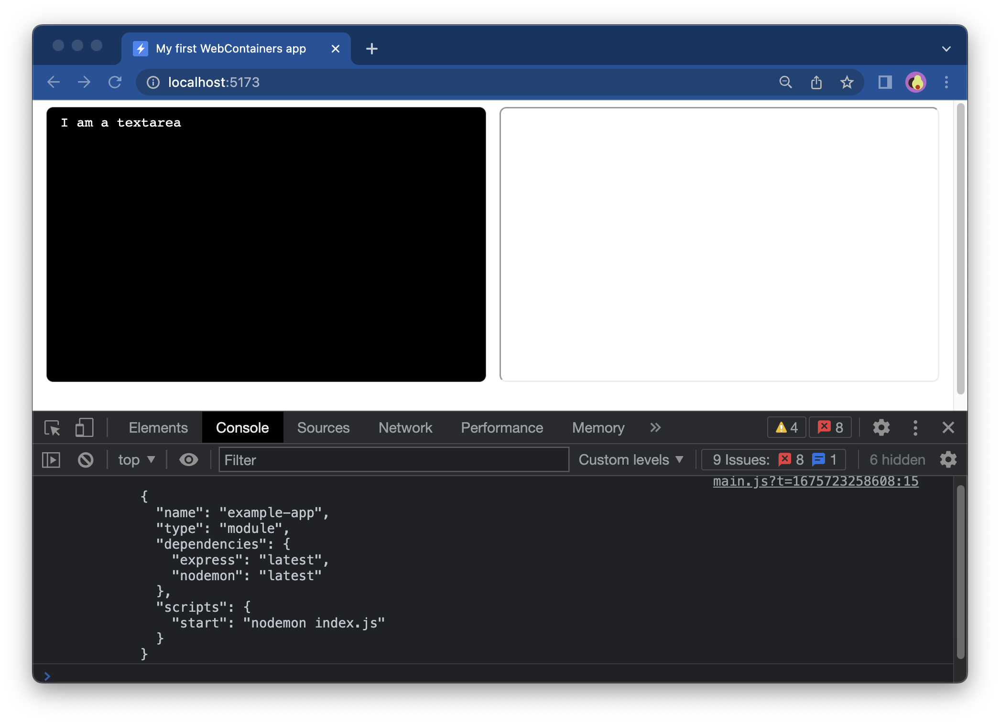

# {{ $frontmatter.title }}

Now that the scaffolding for your app is done, you'll make the dev server capable of running WebContainers and then, you'll boot up the WebContainers with your files.

## 1. Set up COOP/COEP headers

As stated in [Quickstart](/guides/quickstart), WebContainers can only run with the following headers set on the document:

```yaml
Cross-Origin-Embedder-Policy: require-corp
Cross-Origin-Opener-Policy: same-origin
```

Let's get these set. Open your `vite.config.js` file (or create it in your app's root directory if it doesn't exist) and add the following code:

::: code-group

```js [vite.config.js]
import { defineConfig } from 'vite';

export default defineConfig({
  server: {
    headers: {
      'Cross-Origin-Embedder-Policy': 'require-corp',
      'Cross-Origin-Opener-Policy': 'same-origin',
    },
  },
});
```

:::

We need to restart the Vite app now. To do so, in your terminal stop the dev server (`ctrl`+`c`). Then, start it again by running `npm run dev`. Next, hard reload the page in the browser (`cmd`+`shift`+`r` on Mac and `ctrl`+`shift`+`r` on Windows and Linux). The headers are now enabled.

## 2. Install WebContainer API package

To add the WebContainer API to your app, install their npm package by running the following code in the terminal (in your app's root directory):

```bash
npm i @webcontainer/api
```

## 3. Boot up a WebContainer instance

Add the following code to the `main.js` file after the first `import` statement:

```js
import { WebContainer } from '@webcontainer/api';

/** @type {import('@webcontainer/api').WebContainer}  */
let webcontainerInstance;

window.addEventListener('load', async () => {
  // Call only once
  webcontainerInstance = await WebContainer.boot();
});
```

Congrats - your first WebContainer app is already running in the background 👏

## 3. Create the files

Let's now add an Express app to the WebContainer. It is going to have two files: `index.js` and `package.json`. The output of this app will be visible in the Preview window on the right.

For your reference, their contents are as follows (no need to copy):

::: code-group

```js [index.js]
import express from 'express';

const app = express();
const port = 3111;

app.get('/', (req, res) => {
  res.send('Welcome to a WebContainers app! 🥳');
});

app.listen(port, () => {
  console.log(`App is live at http://localhost:${port}`);
});
```

:::

And, `package.json`:

::: code-group

```json [package.json]
{
  "name": "example-app",
  "type": "module",
  "dependencies": {
    "express": "latest",
    "nodemon": "latest"
  },
  "scripts": {
    "start": "nodemon index.js"
  }
}
```

:::

So, how to get these files *inside* the WebContainer?

First, in your app's root directory create a new file called `files.js` where you will store the object containing these files. Later on, you will then pass this object to a method called `mount`.

While you can keep them in `main.js` we suggest having a separate file in this tutorial for code clarity.

::: code-group

```js [files.js]
/** @satisfies {import('@webcontainer/api').FileSystemTree} */

export const files = {
  'index.js': {
    file: {
      contents: `
import express from 'express';
const app = express();
const port = 3111;

app.get('/', (req, res) => {
  res.send('Welcome to a WebContainers app! 🥳');
});

app.listen(port, () => {
  console.log(\`App is live at http://localhost:\${port}\`);
});`,
    },
  },
  'package.json': {
    file: {
      contents: `
{
  "name": "example-app",
  "type": "module",
  "dependencies": {
    "express": "latest",
    "nodemon": "latest"
  },
  "scripts": {
    "start": "nodemon index.js"
  }
}`,
    },
  },
};
```

:::

As you can see, we have a `files` object, which contains the files we want to load into the WebContainer.

::: tip
If you struggle with the structure of this object, please visit [the section on the mental model](/guides/working-with-the-file-system.html#mental-model) of the file system.
:::

Last but not least, add another import statement to `main.js`:

::: code-group

```js [main.js]
import { files } from './files';
```

:::

## 4. Load the files

Now, let's load these files into the WebContainer. Take a look at the highlighted line in the snippet below:

::: code-group

```js {11} [main.js]
import './style.css';
import { WebContainer } from '@webcontainer/api';
import { files } from './files';

/** @type {import('@webcontainer/api').WebContainer}  */
let webcontainerInstance;

window.addEventListener('load', async () => {
  // Call only once
  webcontainerInstance = await WebContainer.boot();
  await webcontainerInstance.mount(files);
});

```

:::

To confirm that it worked, let's read the contents of `package.json` from WebContainer by using the `fs.readFile` method provided by `webcontainerInstance` and log it into the console:

```js {6-7}
window.addEventListener('load', async () => {
  // Call only once
  webcontainerInstance = await WebContainer.boot();
  await webcontainerInstance.mount(files);

  const packageJSON = await webcontainerInstance.fs.readFile('package.json', 'utf-8');
  console.log(packageJSON);
});
```

Now, open the console of your dev tools and see the output:



You can now delete the last two lines.

::: info Learn more: WebContainers behavior

At this point, you may notice that WebContainers send requests to `staticblitz.com`. This is our domain to host/serve our static assets and package manager-related requests. In some cases, you may see a few calls to this domain - for example when you're installing dependencies and don't have a lockfile, which will require a full dependency resolution and multiple calls to the npm registry.

:::

## 5. Set `textarea`'s value

Now that you have a file system, you can print the contents of a file in the `textarea`, for example, the `index.js` file:

```js {2}
window.addEventListener('load', async () => {
  textareaEl.value = files['index.js'].file.contents;
  
  // Call only once
  webcontainerInstance = await WebContainer.boot();
  await webcontainerInstance.mount(files);
});
```

Now you should see the contents of the file rendered in the `textarea` box:


## Next step

Your first WebContainer app is ready and running 🔥 [In the next step](./3-installing-dependencies.md), you'll install the dependencies.
