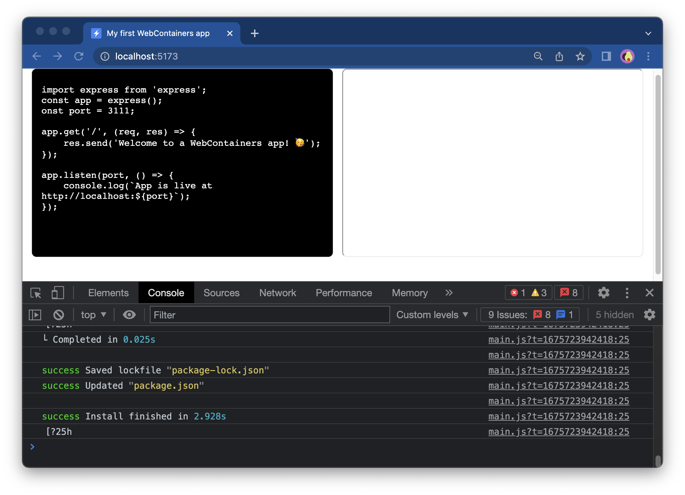

# Installing dependencies

You can run various commands inside WebContainers like, for example, `npm install` as follows:

```js
webcontainerInstance.spawn('npm', ['install']);
```

This code runs `npm` with the `install` argument inside the WebContainer instance.

::: tip Tip
You can also use `pnpm` or `yarn` instead of npm. To do so, replace `npm` in the above code with your package manager of choice.
:::

## Syntax

Before we begin, let's take a look at the syntax: we break down commands into their constituent parts, and then pass them to the `run` method. In this way:

```bash
cd hello-world
```

becomes:

```js
webcontainerInstance.spawn('cd', ['hello-world']);
```

And if you have a command with two arguments, both arguments will be added to the array, like so:
```bash
ls src -l
```

becomes:
```js
webcontainerInstance.spawn('ls', ['src', '-l']);
```

## 1. Install dependencies

In the `main.js` file, add an `installDependencies` function:

::: code-group

```js {11-24} [main.js]
async function installDependencies() {
  // Install dependencies
  const installProcess = await webcontainerInstance.spawn('npm', ['install']);
  // Wait for install command to exit
  return installProcess.exit;
}
```

:::

This function will install the dependencies and return the exit code. If it's `0`, it means the command exited successfully.

## 2. Call the function

Next, call `installDependencies()` inside the event listener you wrote earlier and you can add error handling:

```js {7-10}
window.addEventListener('load', async () => {
  textareaEl.value = files['index.js'].file.contents;
  // Call only once
  webcontainerInstance = await WebContainer.boot();
  await webcontainerInstance.mount(files);

  const exitCode = await installDependencies();
  if (exitCode !== 0) {
    throw new Error('Installation failed');
  };
});
```

Note that it is possible to read the output of this command.

```js
  const installProcess = await webcontainerInstance.spawn('npm', ['install']);
  
  installProcess.output.pipeTo(new WritableStream({
    write(data) {
      console.log(data);
    }
  }));
```

The `output` property is capable of streaming the output.

This means that, for example, by running `npm install`, you will get every single line from `npm` installing the code:



::: info Want to learn more about `WritableStream`?

For more information on the `Writable Stream`, check the Deep Dive on the ["Running Processes"](../guides/running-processes#reading-the-output) page.

:::


## Next step

Your WebContainer app is now installing dependencies ✨ [In the next step](./4-running-dev-server.md), you'll run the dev server.
