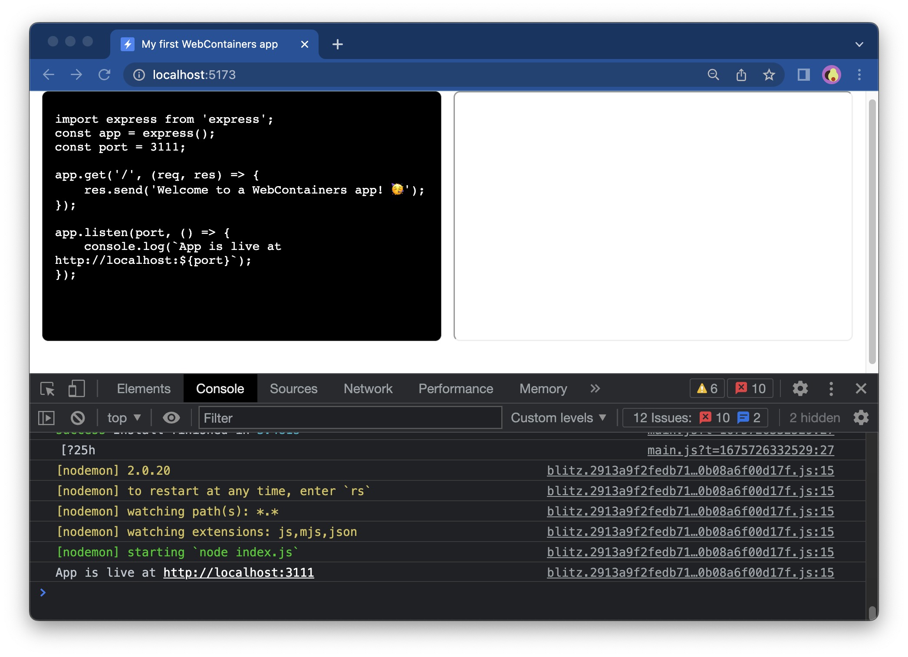

# Running dev server

Now that your app is able to install dependencies, you can run the dev server. Let's add some code that will:

1. run `npm run dev`,
2. listen to `server-ready` event,
3. and then assign URL to the iframe.

WebContainers expose the `server-ready` event, which is emitted when the server is ready to accept requests. You can listen to this event using `webcontainerInstance.on`.

Let's add this code to the `main.js` file
::: code-group

```js [main.js]
async function startDevServer() {
  // Run `npm run start` to start the Express app
  await webcontainerInstance.spawn('npm', ['run', 'start']);

  // Wait for `server-ready` event
  webcontainerInstance.on('server-ready', (port, url) => {
    iframeEl.src = url;
  });
}
```

:::

In your browser dev tools, after you run `startDevServer()` in the next step, you will be able to see the dev server running:



Remember the `iframeEl` you defined at the beginning of this tutorial? Now is the time for it to shine! You are setting the `iframeEl`'s `src` to the URL of the Express app, which will print its output in the iframe.

Let's call the function in the event listener:

::: code-group

```js {12} [main.js]
window.addEventListener('load', async () => {
  textareaEl.value = files['index.js'].file.contents;
  // Call only once
  webcontainerInstance = await WebContainer.boot();
  await webcontainerInstance.mount(files);

  const exitCode = await installDependencies();
  if (exitCode !== 0) {
    throw new Error('Installation failed');
  };

  startDevServer();
});
```

Your Express app is running inside WebContainers!


## Next step

Congratulations! You have an Express app running in your browser with WebContainers 🥳 [In the next step](./5-editing-a-file-updating-the-iframe.md), you'll edit the files.
