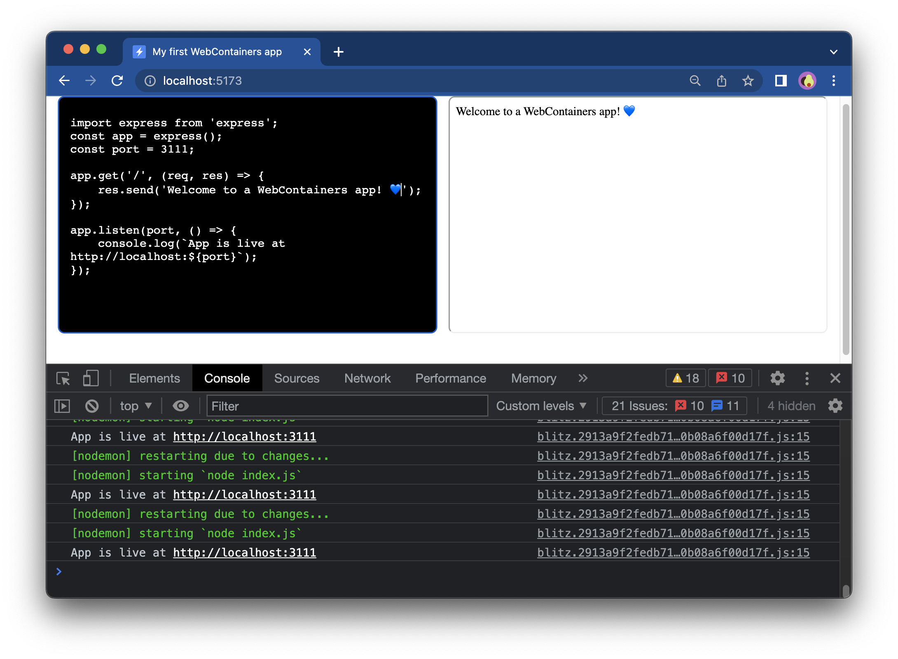

# Editing a file and updating the iframe

Your Express app is up and running in WebContainers, but if you edit the `textarea`, the changes are not reflected in the Preview window at all. Let's change that.

## 1. Create a function to write a file

To change the contents of a file, you will use the `fs.writeFile` method.

In this case, you're editing only `index.js` so the function will be quite concise.

```js [main.js]
/** @param {string} content*/

async function writeIndexJS(content) {
  await webcontainerInstance.fs.writeFile('/index.js', content);
};
```

## 2. Listen to `textarea` changes

Now that you have a function to write the file, you can listen to `textarea` value change and call this function. To do so, attach the `input` event listener to the `textareaEl`:

```js {4-6}
window.addEventListener('load', async () => {
  textareaEl.value = files['index.js'].file.contents;

  textareaEl.addEventListener('input', (e) => {
    writeIndexJS(e.currentTarget.value);
  });
});
```

Try changing the emoji now.



And voilà! We have a working editor with the Preview. You've built your own environment!

## Next steps

Your application is now entirely up and running. However, it would be nice if you could see the output of all the commands inside your application instead of inside the DevTools console. [In the next step](./6-connect-a-terminal.md), you'll attach a terminal to the WebContainer processes to show the output.
