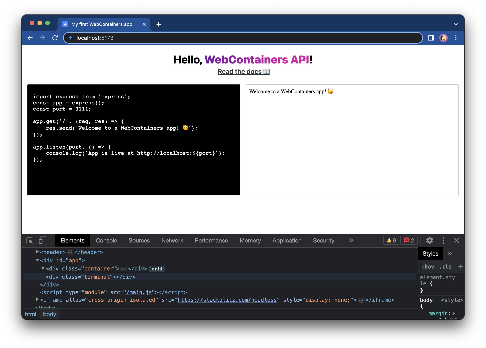
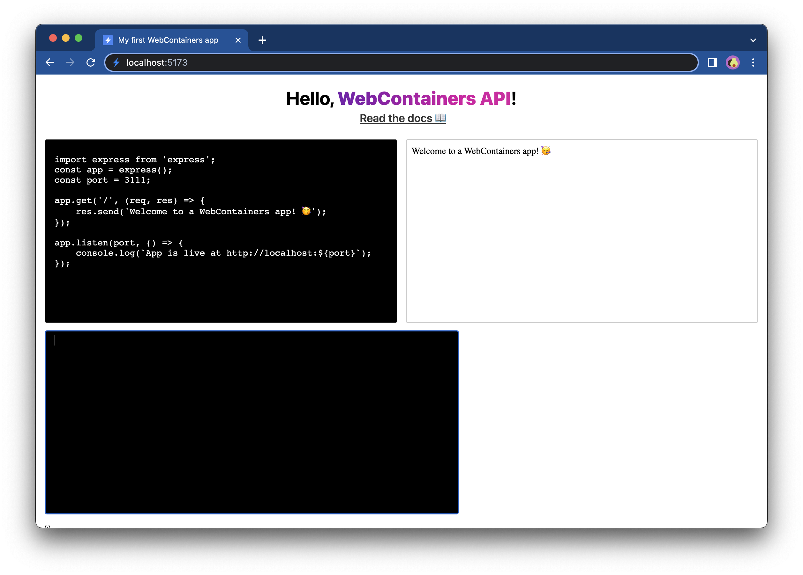
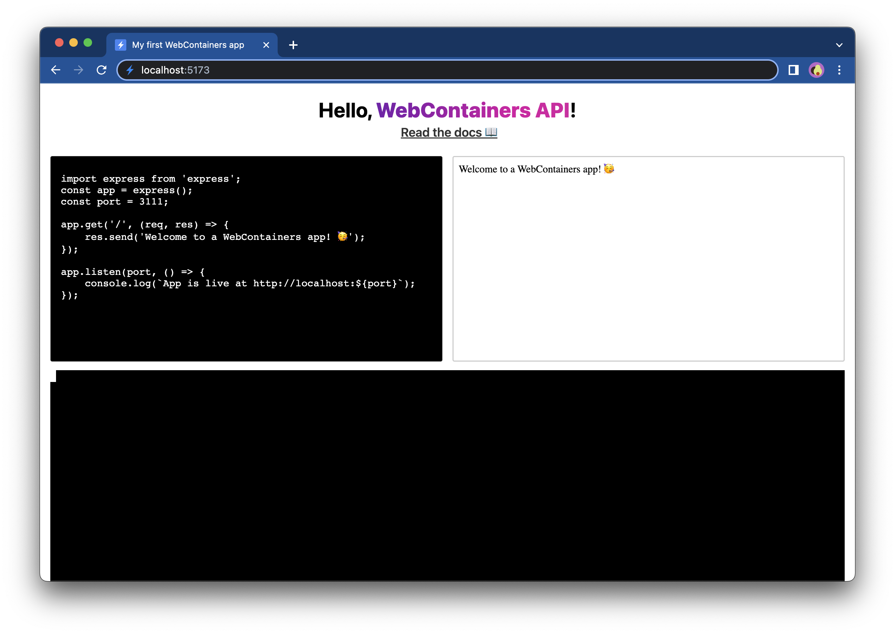
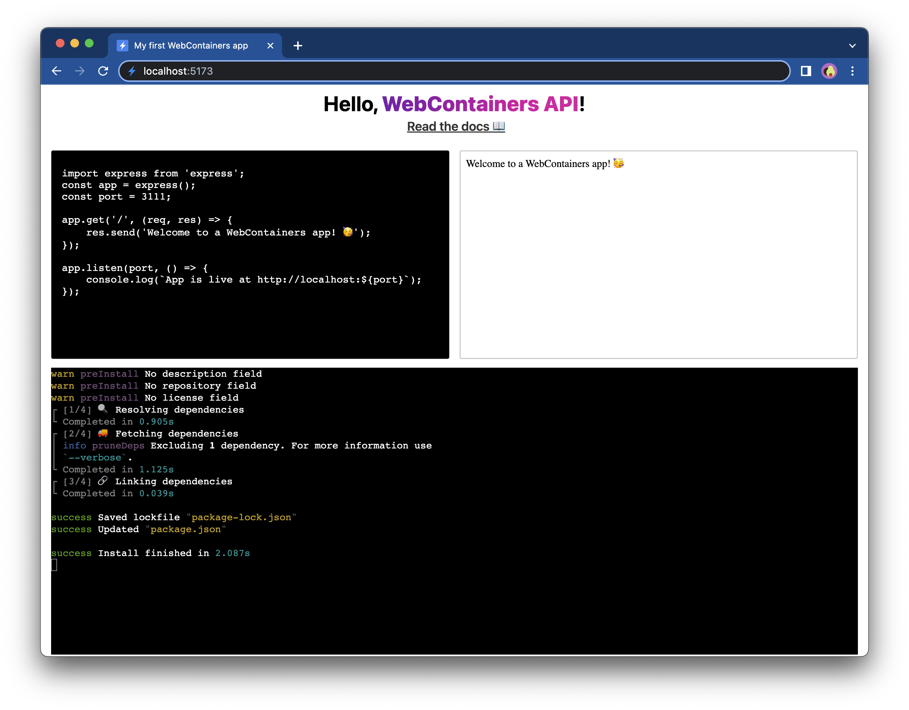
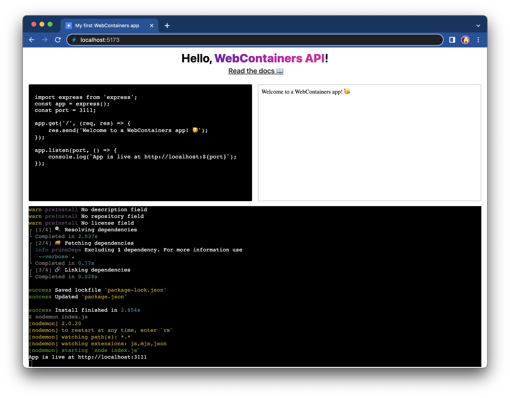

# Connect a terminal

Your Express app is up and running and the preview window updates automatically when the `textarea` changes. However, opening the DevTools to see the WebContainers output is not the most productive. So let's add a terminal which shows the output.

## 1. Install `Xterm.js`

We could print the output of our processes to a `div`. A process could also print messages with different colors or styles. In order to achieve this, we will use [`Xterm.js`](https://xtermjs.org), which is a terminal frontend component. To install it, run the following command in your terminal:

```bash
npm install xterm
```

## 2. Build terminal scaffolding

Your application terminal will be rendered in a new HTML element. In the `main.js` file, find the `querySelector(#app)` portion of your code and add a new `div` like in the example below:

:::code-group
```js [main.js] {10}
document.querySelector('#app').innerHTML = `
  <div class="container">
    <div class="editor">
      <textarea>I am a textarea</textarea>
    </div>
    <div class="preview">
      <iframe src="loading.html"></iframe>
    </div>
  </div>
  <div class="terminal"></div>
`;
```
:::

This element will serve as a parent element for the terminal. You can't see any changes in your app but if you inspect the element in the browser DevTools, you will see it's there:



## 3. Set a reference

Let's add a way to reference the `div` which will host the terminal in the same way as you reference our `textarea` and `iframe`. Add the following line at the bottom of the `main.js` file:

:::code-group
```js [main.js]
/** @type {HTMLTextAreaElement | null} */
const terminalEl = document.querySelector('.terminal');
```
:::

## 4. Create a terminal instance

Now that you added the DOM node which you can use to render the terminal, create a terminal instance and render it.

First of all, import `Xterm.js`. Add the import statement at the top of the `main.js` file:

:::code-group
```js [main.js]
import { Terminal } from 'xterm'
```
:::

Now create a new terminal and attach it to `terminalEl`:

:::code-group
```js [main.js] {7-10}
window.addEventListener('load', async () => {
  textareaEl.value = files['index.js'].file.contents;
  textareaEl.addEventListener('input', (e) => {
    writeIndexJS(e.currentTarget.value);
  });

  const terminal = new Terminal({
    convertEol: true,
  });
  terminal.open(terminalEl);

  // Call only once
  webcontainerInstance = await WebContainer.boot();
  await webcontainerInstance.mount(files);

  const exitCode = await installDependencies();
  if (exitCode !== 0) {
    throw new Error('Installation failed');
  };

  startDevServer();
});
```
:::

The reason `convertEol` is set to `true` is to force the cursor to always start at the beginning of the next line. If this is not enabled, the cursor will still jump to the next line but not to its start. At this point, your terminal looks as follows:



## 5. Style the terminal

The terminal looks a bit plain now. Fortunately, `Xterm.js` ships its own CSS styles and can be imported at the top of our `main.js` file.

:::code-group
```js [main.js]
import 'xterm/css/xterm.css';
```
:::



## 6. Send output to the terminal

Now that the terminal is set up, you can start redirecting the output of the WebContainer processes to that terminal instead of writing it to the DevTools console in the browser.

To do that, get hold of the `terminal` instance inside the `installDependencies` and `startDevServer` methods. Yous can do this by passing `terminal` as an argument to those methods.

:::code-group
```js [main.js] {16,21}
window.addEventListener('load', async () => {
  textareaEl.value = files['index.js'].file.contents;
  textareaEl.addEventListener('input', (e) => {
    writeIndexJS(e.currentTarget.value);
  });

  const terminal = new Terminal({
    convertEol: true,
  });
  terminal.open(terminalEl);

  // Call only once
  webcontainerInstance = await WebContainer.boot();
  await webcontainerInstance.mount(files);

  const exitCode = await installDependencies(terminal);
  if (exitCode !== 0) {
    throw new Error('Installation failed');
  };

  startDevServer(terminal);
});
```
:::

Next, let's print the data to the terminal since we have a reference to the terminal instance:

:::code-group
```js [main.js] {4,9}
/**
 * @param {Terminal} terminal
 */
async function installDependencies(terminal) {
  // Install dependencies
  const installProcess = await webcontainerInstance.spawn('npm', ['install']);
  installProcess.output.pipeTo(new WritableStream({
    write(data) {
      terminal.write(data);
    }
  }))
  // Wait for install command to exit
  return installProcess.exit;
}
```
:::

Refresh the page and you should now see that the output of `npm install` is now shown in our the terminal you just created!



Now, let's make identical changes for the `startDevServer` method to show the output of the `npm run start` command:

:::code-group

```js [main.js] {4,10-16}
/**
 * @param {Terminal} terminal
 */
async function startDevServer(terminal) {
  // Run `npm run start` to start the Express app
  const serverProcess = await webcontainerInstance.spawn('npm', [
    'run',
    'start',
  ]);
  serverProcess.output.pipeTo(
    new WritableStream({
      write(data) {
        terminal.write(data);
      },
    })
  );

  // Wait for `server-ready` event
  webcontainerInstance.on('server-ready', (port, url) => {
    iframeEl.src = url;
  });
}
```
:::

With these changes, you can see the output from both commands: `npm install` and `npm run start`. 



Try changing the code in the `textarea` - you will see that the dev server restarts because of these changes.


## Next step

The output is now visible in a terminal in your web application. This step improves User Experience as your users can now see what is going on and don't have to open the DevTools console anymore 🥳

The terminal is currently only capable of showing the output. [In the next step](./7-make-terminal-interactive.md), you'll make the terminal interactive, which will allow you to run your own commands from within your application!
