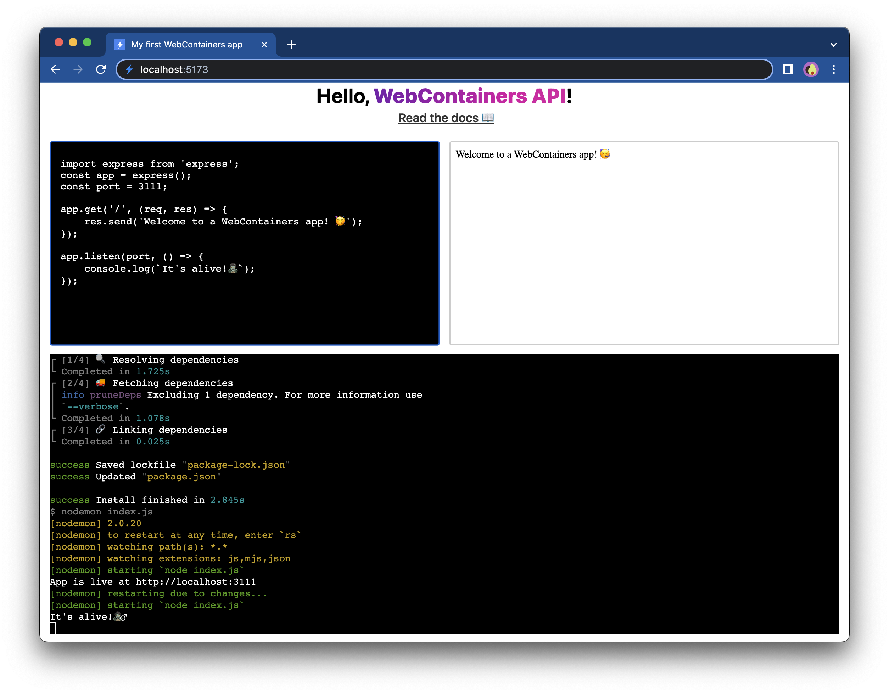

# Connect a terminal

Your Express app is up and running and the preview window updates automatically when the `textarea` changes. However, opening the DevTools to see the WebContainers output is not the most productive. In this step, you'll add a terminal which shows the output.

## 1. Install `Xterm.js`

The terminal frontend component that we will use is [`Xterm.js`](https://xtermjs.org). It's the same terminal that is used by Visual Studio Code and many other web-based IDEs. To install it, run the following command in your development terminal:

```bash
npm install xterm
```

## 2. Build terminal scaffolding

Your application terminal will be rendered in a new HTML element. Find the `querySelector(#app)` portion of the code in the `main.js` file and add a new `div`, like in the example below:

:::code-group
```js [main.js] {10}
document.querySelector('#app').innerHTML = `
  <div class="container">
    <div class="editor">
      <textarea>I am a textarea</textarea>
    </div>
    <div class="preview">
      <iframe src="loading.html"></iframe>
    </div>
  </div>
  <div class="terminal"></div>
`;
```
:::

This `div` will serve as a parent element for the terminal. Right now, you can't see any changes in your app yet but if you inspect the element in the browser DevTools, you will see it's there:


## 3. Set a reference

Let's add a way to reference the terminal `div` in the same way as earlier you referenced the `textarea` and `iframe`. Add the following line at the bottom of the `main.js` file:

:::code-group
```js [main.js]
/** @type {HTMLTextAreaElement | null} */
const terminalEl = document.querySelector('.terminal');
```
:::

## 4. Create a terminal instance

Now that the referencable `div` is in place, you'll create a `Terminal` instance and render it.

First of all, import `Xterm.js`. To do so, add an import statement at the top of the `main.js` file:

:::code-group
```js [main.js]
import { Terminal } from 'xterm'
```
:::

Next, create a new `Terminal` and attach it to `terminalEl`:

:::code-group
```js [main.js] {7-10}
window.addEventListener('load', async () => {
  textareaEl.value = files['index.js'].file.contents;
  textareaEl.addEventListener('input', (e) => {
    writeIndexJS(e.currentTarget.value);
  });

  const terminal = new Terminal({
    convertEol: true,
  });
  terminal.open(terminalEl);

  // Call only once
  webcontainerInstance = await WebContainer.boot();
  await webcontainerInstance.mount(files);

  const exitCode = await installDependencies();
  if (exitCode !== 0) {
    throw new Error('Installation failed');
  };

  startDevServer();
});
```
:::

The reason `convertEol` is set to `true` is to force the cursor to always start at the beginning of the next line. At this point, your terminal looks as follows:


## 5. Style the terminal

The terminal looks a bit plain now. Fortunately, `Xterm.js` ships its own CSS styles and can be imported at the top of the `main.js` file.

:::code-group
```js [main.js]
import 'xterm/css/xterm.css';
```
:::

As you see, now the terminal takes up 100% of the space of the parent `div`. Moreover, other styles have been shipped as well, which you'll use in a bit.


## 6. Send output to the terminal

Now that the terminal is set up, you can start redirecting the output of the WebContainer processes to it instead of to the browser DevTools.

To do that, get a hold of the `Terminal` instance inside the `installDependencies` and `startDevServer` methods. You can do this by saving it to a variable (`terminal` in the example below) and then passing it as an argument to those methods.

:::code-group
```js [main.js] {16,21}
window.addEventListener('load', async () => {
  textareaEl.value = files['index.js'].file.contents;
  textareaEl.addEventListener('input', (e) => {
    writeIndexJS(e.currentTarget.value);
  });

  const terminal = new Terminal({
    convertEol: true,
  });
  terminal.open(terminalEl);

  // Call only once
  webcontainerInstance = await WebContainer.boot();
  await webcontainerInstance.mount(files);

  const exitCode = await installDependencies(terminal);
  if (exitCode !== 0) {
    throw new Error('Installation failed');
  };

  startDevServer(terminal);
});
```
:::

Next, let's print the data to the terminal by refering to the terminal instance:

:::code-group
```js [main.js] {4,9}
/**
 * @param {Terminal} terminal
 */
async function installDependencies(terminal) {
  // Install dependencies
  const installProcess = await webcontainerInstance.spawn('npm', ['install']);
  installProcess.output.pipeTo(new WritableStream({
    write(data) {
      terminal.write(data);
    }
  }))
  // Wait for install command to exit
  return installProcess.exit;
}
```
:::

Refresh the page and you should see that the output of `npm install` is now shown in the terminal you have just created!


Let's make identical changes for the `startDevServer` method to also show the output of the `npm run start` command:

:::code-group

```js [main.js] {4,10-16}
/**
 * @param {Terminal} terminal
 */
async function startDevServer(terminal) {
  // Run `npm run start` to start the Express app
  const serverProcess = await webcontainerInstance.spawn('npm', [
    'run',
    'start',
  ]);
  serverProcess.output.pipeTo(
    new WritableStream({
      write(data) {
        terminal.write(data);
      },
    })
  );

  // Wait for `server-ready` event
  webcontainerInstance.on('server-ready', (port, url) => {
    iframeEl.src = url;
  });
}
```
:::

With these changes, you can see the output from both commands: `npm install` and `npm run start`. 


Try changing the code in the `textarea` - you will see that the dev server restarts because of these changes.



## Next step

The output is now visible in a terminal in your web application. This step improves User Experience - your users no longer have to open the DevTools console to see what's going on 🥳.

The terminal is currently only capable of showing the output. [In the next step](./7-add-interactivity.md), you'll make it interactive, which will allow you to run your own commands from within your application!
