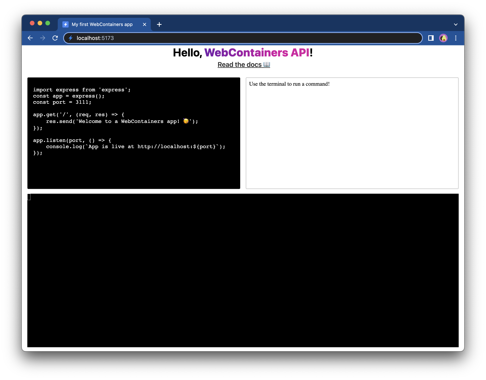
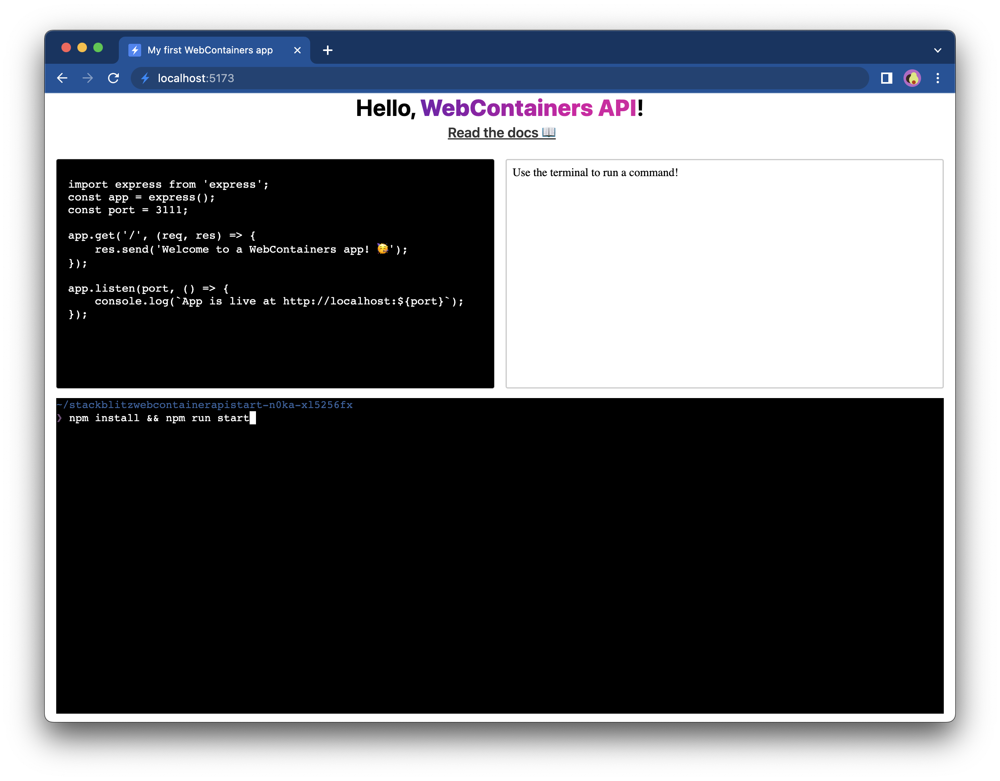
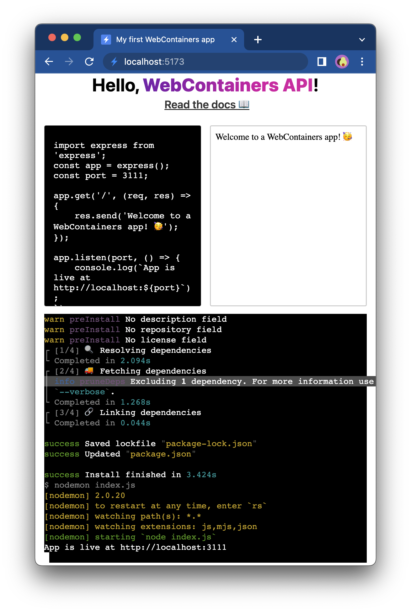
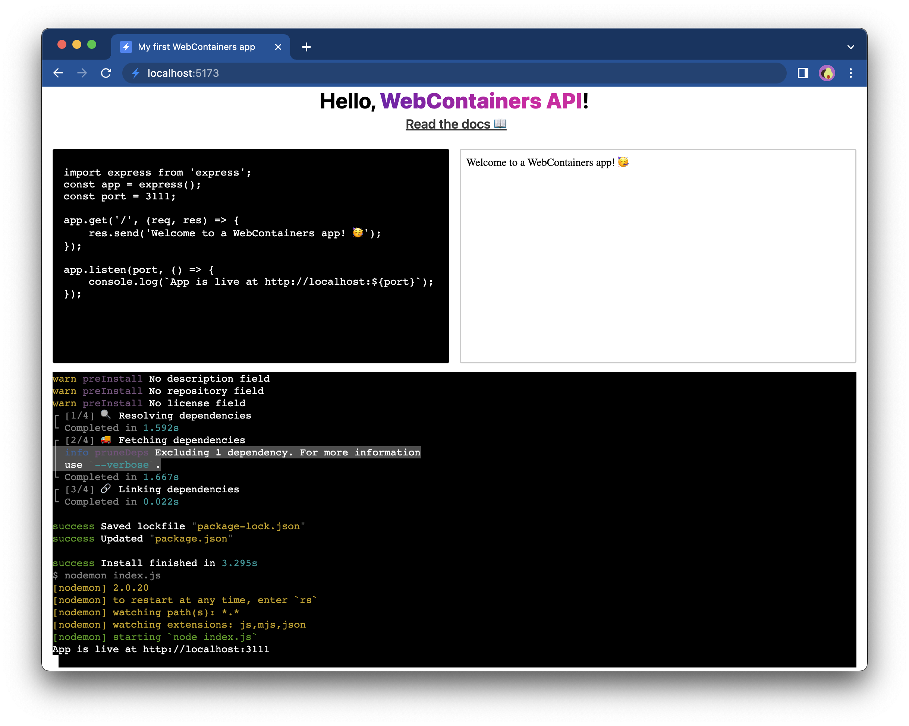
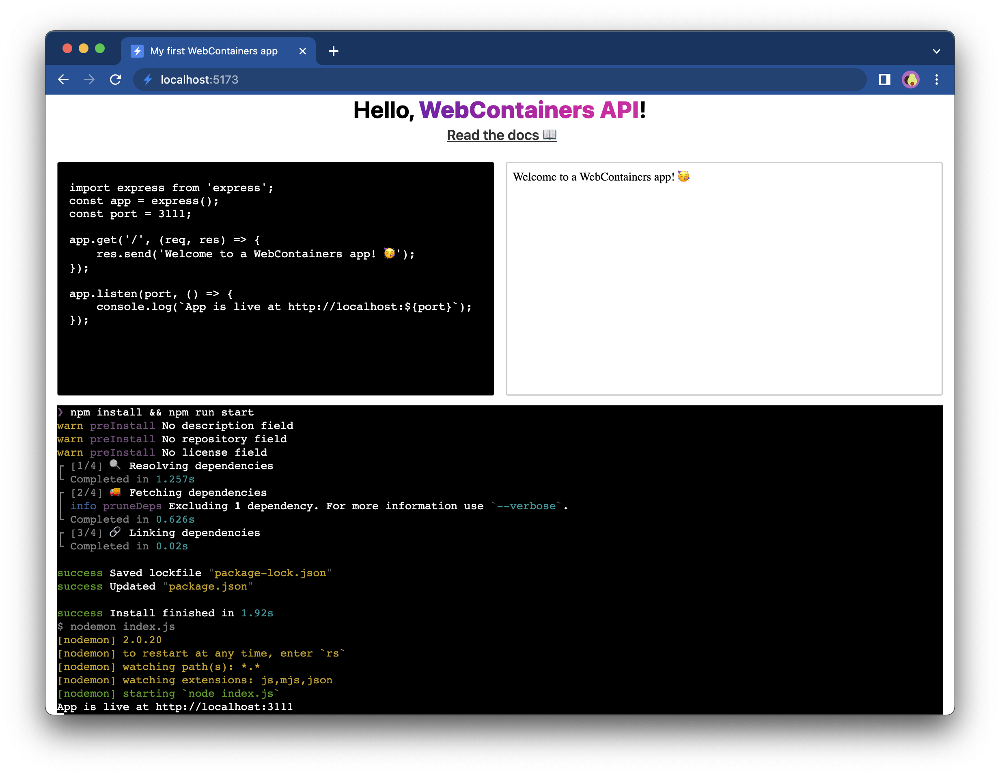

# Add interactivity

The terminal in your application capable to print the logs with proper formatting. It doesn't, however, accept user input. It would be nice if we could convert this experience to a real terminal which allows you to install other packages, and run different commands... Let's get started!

## 1. Remove code

Isn't the best feeling when as a developer you can remove code which isn't necessary anymore? In this step, you can remove both the `installDependencies` and `startDevServer` methods! You won't need them as now it's your user who will type and run the commands.

The only thing that you'd need to keep is the listener for the `server-ready` event, which now will look as following:

:::code-group

```js [main.js] {16-19}
window.addEventListener('load', async () => {
  textareaEl.value = files['index.js'].file.contents;
  textareaEl.addEventListener('input', (e) => {
    writeIndexJS(e.currentTarget.value);
  });

  const terminal = new Terminal({
    convertEol: true,
  });
  terminal.open(terminalEl);

  // Call only once
  webcontainerInstance = await WebContainer.boot();
  await webcontainerInstance.mount(files);

  // Wait for `server-ready` event
  webcontainerInstance.on('server-ready', (port, url) => {
    iframeEl.src = url;
  });
});
```
:::

Open the `loading.html` file and change the message there as well:

```html
Use the terminal to run a command!
```



## 2. Start the shell

To make the terminal a bit more usuable, we could spawn `jsh`.

:::details What is `jsh`?
Here's a quote from the [jsh docs](https://www.npmjs.com/package/jsh):
> `jsh` is a small JavaScript library (with no dependencies!) that provides helper aliases and functions that are similar to Bash syntax, allowing you to write shell scripts in JavaScript / Node.js that are simple and familiar.
:::

Using `jsh` serves as an alternative to spawning commands separately. Create a new function called `startShell` which will write the output stream of the process to the `Xterm.js` terminal instance:

:::code-group
```js [main.js]
/**
 * @param {Terminal} terminal
 */
async function startShell(terminal) {
  const shellProcess = await webcontainerInstance.spawn('jsh');
  shellProcess.output.pipeTo(
    new WritableStream({
      write(data) {
        terminal.write(data);
      },
    })
  );
};
```
:::


Now, start the shell by calling the `startShell` function at the end of the event listener:

```js {21}
window.addEventListener('load', async () => {
  textareaEl.value = files['index.js'].file.contents;
  textareaEl.addEventListener('input', (e) => {
    writeIndexJS(e.currentTarget.value);
  });

  const terminal = new Terminal({
    convertEol: true,
  });
  terminal.open(terminalEl);

  // Call only once
  webcontainerInstance = await WebContainer.boot();
  await webcontainerInstance.mount(files);

  // Wait for `server-ready` event
  webcontainerInstance.on('server-ready', (port, url) => {
    iframeEl.src = url;
  });

  startShell(terminal);
});
```

## 3. Add interactivity to the terminal

It's still not possible to actually do anything with the terminal. If you try writing in the terminal, nothing will print as it only renders output and still does not yet accept input. Let's change that!

Just like the [`output`](/api#▸-output-readablestream-string) property of the WebContainer process is a [`ReadableStream`](https://developer.mozilla.org/en-US/docs/Web/API/ReadableStream), the [`input`](/api#▸-input-writablestream-string) property of the process is a [`WritableStream`](https://developer.mozilla.org/en-US/docs/Web/API/WritableStream). By writing data to the writable `input` stream, that data is sent to the WebContainer process.

Let's change the `startShell` function to accommodate that:

:::code-group
```js [main.js] {11-14}
async function startShell(terminal) {
  const shellProcess = await webcontainerInstance.spawn('jsh');
  shellProcess.output.pipeTo(
    new WritableStream({
      write(data) {
        terminal.write(data);
      },
    })
  );

  const input = shellProcess.input.getWriter();
  terminal.onData((data) => {
    input.write(data);
  });

  return shellProcess;
};
```
:::

:::details Deep dive: What happened in this function?
The first thing you do here is getting hold of a writer by using [`WritableStream.getWriter`](https://developer.mozilla.org/en-US/docs/Web/API/WritableStream/getWriter). Calling this method will lock the input stream which means that noone else can get another writer to that process. After you have your writer, you can listen for input received by the terminal. Every time you type a character in the terminal, the [`onData`](http://xtermjs.org/docs/api/terminal/classes/terminal/#ondata) handler is called. Inside that handler you can write the data to the `input` stream of our process.
:::

With this change, you hooked up your terminal to the shell running in the WebContainer process. This means that you can now also send input to the process and run commands. You can now manually run `npm install && npm run start` or run any other command.




## 4. Add `xterm-addon-fit`

You might've noticed that resizing the window doesn't redraw the terminal output. For instance, if you make the window very small, lines that are too long should wrap to the next line. For example, look at the highlightened line:



To fix this, you'll need to make the WebContainer process aware of the size of the terminal.

First of all, let's make sure that the terminal itself gets adjusted properly when resizing the window. To do that, you can use the [`xterm-addon-fit`](http://xtermjs.org/docs/api/addons/fit/) plugin for `Xterm.js` which adjusts the terminal columns and rows depending on the element it's rendered in.

First, install the plugin:

```bash
npm install xterm-addon-fit
```

And import it at the top of your `main.js` file.

:::code-group
```js [main.js]
import { FitAddon } from 'xterm-addon-fit';
```
:::

## 5. Resize the terminal

Next, create a new `FitAddon` instance and load it into the terminal.

:::code-group
```js [main.js] {7,12,15}
window.addEventListener('load', async () => {
  textareaEl.value = files['index.js'].file.contents;
  textareaEl.addEventListener('input', (e) => {
    writeIndexJS(e.currentTarget.value);
  });

  const fitAddon = new FitAddon();

  const terminal = new Terminal({
    convertEol: true,
  });
  terminal.loadAddon(fitAddon);
  terminal.open(terminalEl);

  fitAddon.fit();

  // Call only once
  webcontainerInstance = await WebContainer.boot();
  await webcontainerInstance.mount(files);

  // Wait for `server-ready` event
  webcontainerInstance.on('server-ready', (port, url) => {
    iframeEl.src = url;
  });

  startShell(terminal);
});
```
:::

Notice that the `fit()` method is also called on the addon immediately after attaching the terminal to the DOM to make sure that the terminal takes up the entire height and width of the `div` terminal element.

## 6. Resize the output lines

The terminal itself now has proper dimensions, but the WebContainer process that runs the shell is still not aware of what the exact dimensions are. To fix that, pass in the dimensions when spawning the WebContainer process.

:::code-group
```js [main.js] {3-6}
async function startShell(terminal) {
  const shellProcess = await webcontainerInstance.spawn('jsh', {
    terminal: {
      cols: terminal.cols,
      rows: terminal.rows,
    },
  });
  shellProcess.output.pipeTo(
    new WritableStream({
      write(data) {
        terminal.write(data);
      },
    })
  );

  const input = shellProcess.input.getWriter();

  terminal.onData((data) => {
    input.write(data);
  });
}
```
:::

You can now see that the text is properly wrapped to the width of the terminal. Compare the same highlightened line now:


## 7. Make output lines responsive

The last piece of code that you added equipped the terminal element on your app with the ability to resize. What's actually happening is that the `cols` and `rows` of the `Terminal` instance from `Xterm.js` are recalculated and updated. The last problem to address is that if you  make the window wider again, the terminal does not redraw the text to fit the new dimensions. 



In order to make the terminal fully responsive, you can use the [`resize`](/api#▸-resize) method on the WebContainer shell process.

:::code-group
```js [main.js] {26-32}
window.addEventListener('load', async () => {
  textareaEl.value = files['index.js'].file.contents;
  textareaEl.addEventListener('input', (e) => {
    writeIndexJS(e.currentTarget.value);
  });

  const fitAddon = new FitAddon();

  const terminal = new Terminal({
    convertEol: true,
  });
  terminal.loadAddon(fitAddon);
  terminal.open(terminalEl);

  fitAddon.fit();

  // Call only once
  webcontainerInstance = await WebContainer.boot();
  await webcontainerInstance.mount(files);

  // Wait for `server-ready` event
  webcontainerInstance.on('server-ready', (port, url) => {
    iframeEl.src = url;
  });

  const shellProcess = await startShell(terminal);
  window.addEventListener('resize', () => {
    fitAddon.fit();
    shellProcess.resize({
      cols: terminal.cols,
      rows: terminal.rows,
    });
  });
});
```
:::

With this code, you notify the process that a resize event happened and then you pass in the new dimensions of the terminal. This causes the process to redraw the screen again.



To see the end product, check [this demo](https://stackblitz.com/edit/stackblitz-webcontainer-api-starter-with-terminal?file=main.js).

## Next steps

If you'd like to explore the API on your own, you can check out the [API reference](../api) or see the [projects made by our Community](/guides/community-inspirations).
